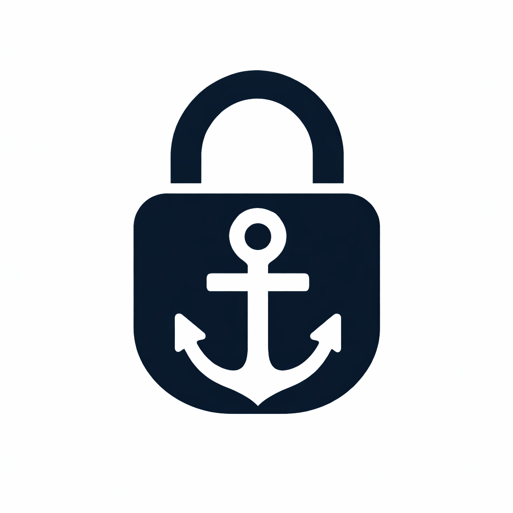

# Portlock

<p align="center">
  
</p>

[](https://www.npmjs.com/package/portlock)
[](https://github.com/johndockery/portlock/actions/workflows/ci.yml)
[](./LICENSE)

Portlock gives each git worktree a deterministic local runtime identity.

Instead of manually juggling ports across branches, Portlock assigns a stable base range to each worktree and derives the rest of your local topology from it:

- service ports
- service URLs
- namespace values
- machine-readable metadata

This is useful when multiple developers, agents, or parallel worktrees are running the same app on one machine.

## Why It Exists

When several worktrees share one laptop, the usual local defaults break down:

- two services try to bind the same port
- one worktree talks to another worktree's API by accident
- local Redis keys, database names, and temporary state blur together
- scripts assume `localhost:3000` means "mine" when it does not

Portlock treats each worktree like a lightweight local tenant.

## Install

```bash
npm install -g portlock
```

Or run it without a global install:

```bash
npx portlock init
```

For local development on this repo:

```bash
npm link
```

## Quick Start

1. Create a `.portlock.json` file in your repo root.
2. Run `portlock init` inside a git worktree.
3. Source `.env.portlock` from your local dev scripts.
4. Use `.portlock/meta.json` if another tool needs structured metadata.

Example:

```bash
portlock init
source .env.portlock
```

Example output:

```bash
API_PORT=3100
WEB_PORT=3101
NEXT_PUBLIC_API_URL=http://127.0.0.1:3100
PORTLOCK_CLAIM=feature-x
PORTLOCK_BASE=3100
PORTLOCK_LABEL="FEATURE-X / 3100"
```

## Example Config

Create `.portlock.json` in your repo root:

```json
{
  "basePort": 3000,
  "step": 100,
  "stripPrefixes": ["users/john/", "branches/"],
  "services": {
    "api": {
      "offset": 0,
      "env": {
        "API_PORT": "{port}",
        "API_HOST": "0.0.0.0",
        "API_ORIGIN": "http://127.0.0.1:{port}"
      }
    },
    "web": {
      "offset": 1,
      "env": {
        "WEB_PORT": "{port}",
        "WEB_ORIGIN": "http://127.0.0.1:{port}",
        "NEXT_PUBLIC_API_URL": "http://127.0.0.1:{api}"
      }
    },
    "workers": {
      "offset": 80,
      "env": {
        "WORKERS_HEALTH_CHECK_PORT": "{port}"
      }
    }
  },
  "namespace": {
    "env": {
      "PORTLOCK_NAMESPACE": "app:{claim}",
      "REDIS_KEY_PREFIX": "app:{claim}",
      "PGDATABASE": "app_{claim}"
    }
  },
  "metadata": {
    "env": {
      "PORTLOCK_CLAIM": "{claim}",
      "PORTLOCK_BASE": "{base}",
      "PORTLOCK_LABEL": "{label}"
    }
  }
}
```

Template tokens:

- `{base}`: assigned base port
- `{claim}`: derived worktree claim
- `{label}`: human-readable label
- `{port}`: current service port
- `{api}`, `{web}`, `{workers}`: sibling service ports

## Commands

```bash
portlock init
portlock env
portlock status
portlock release
portlock cleanup
portlock current --json
portlock resolve api
```

What they do:

- `init`: claim or reuse a base range for the current worktree and write local outputs
- `env`: print derived environment variables for the current worktree
- `status`: list active claims on the current machine
- `release`: release the current worktree's claim
- `cleanup`: remove stale claims for deleted worktrees
- `current --json`: print the current worktree's identity as JSON
- `resolve <service>`: print the resolved port or origin for a service

## Generated Files

`portlock init` writes:

- `.env.portlock`
- `.portlock/meta.json`

`.env.portlock` is meant for shell scripts and local process startup.

`.portlock/meta.json` is meant for tools that want structured data without parsing shell syntax.

## How It Works

Each worktree discovers its own runtime identity locally.

When you run `portlock init`, Portlock:

1. reads the current git context
2. derives a claim from the branch and worktree
3. acquires a machine-global lock
4. checks the shared claim store at `~/.portlock/lock.json`
5. reuses or assigns a base range
6. writes local outputs into the current worktree

Example:

```text
/Users/john/code/app                 branch=main        -> base 3000
/Users/john/code/app-feature-a       branch=feature-a   -> base 3100
/Users/john/code/app-feature-b       branch=feature-b   -> base 3200
```

Different branches do not need to know about each other directly. They coordinate through the shared machine-level claim store during `init`.

## Integration Example

In a shell script:

```bash
if [ -f .env.portlock ]; then
  set -a
  source .env.portlock
  set +a
fi

API_PORT="${API_PORT:-3000}"
WEB_PORT="${WEB_PORT:-3001}"
```

## Scope

Portlock does:

- deterministic local port assignment
- cross-service URL derivation
- optional namespace generation for local shared state
- machine-readable worktree metadata

Portlock does not:

- manage processes
- provision databases or Redis instances
- create proxy hostnames
- isolate worktrees with containers or network namespaces

## Notes

- Port assignment is machine-global, not repo-local
- Claims are tracked with repo metadata for cleanup and display
- Duplicate claim suffixes are stable only for the lifetime of an active claim

## Development

```bash
npm test
npm pack --dry-run
```

GitHub Actions workflows are included for CI and publishing.

## Project Files

- [Contributing](./CONTRIBUTING.md)
- [Code of Conduct](./CODE_OF_CONDUCT.md)
- [Security Policy](./SECURITY.md)
- [Changelog](./CHANGELOG.md)

## License

MIT
